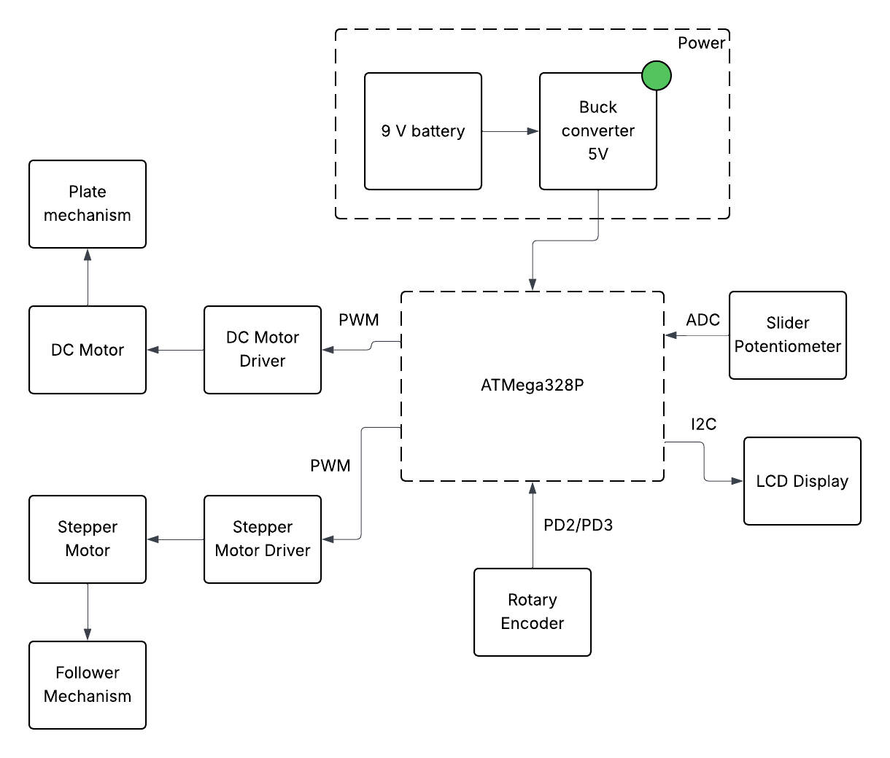
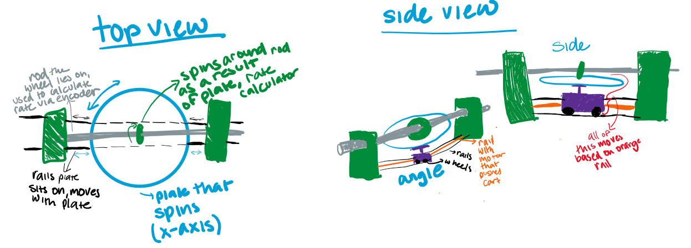

# Final Project

**Team Number: 8**

**Team Name: Integr8**

| Team Member Name | Email Address       |
|------------------|---------------------|
| Anjali Kalanidhi         | anjk@seas.upenn.edu           |
| Nevan Sujit         | tsnevan@seas.upenn.edu          |
| Sebastian William Thomann Studholme         | sthomann@seas.upenn.edu           |

**GitHub Repository URL: https://github.com/upenn-embedded/final-project-s26-t8**

**GitHub Pages Website URL:** [for final submission]*

## Final Project Proposal

### 1. Abstract
A mechanical integrator is a device that physically computes the integral of a function by converting a changing input into accumulated motion over time. Historically, mechanisms like these were used in early analog computers to solve math problems before modern digital computers were available. In this project, we are building a microcontroller-assisted mechanical integrator that demonstrates this concept in an interactive way. A slider potentiometer allows the user to control a time-varying input value, which is read by an ATmega328P microcontroller. The system drives a motor that changes speed as an analog to the function value over time and the mechanical integrator uses the motor encodings to calculate the accumulated distance travelled over time, which is an analog to an integral. The microcontroller will output the behavior of the input and the resulting integral on a small LED display and on the serial plotter. 

### 2. Motivation
We are building our mechanical integrator to create a more computation-efficient way to solve integrals, particularly because the ATMega328P is not well-suited for computing complex mathematical problems. This project is interesting because we are building a mechanical integrator, a device that was historically used to calculate complex integrals, but updating it with the modern firmware capabilities of the ATMega to show that analog based technologies still have their merits.

### 3. System Block Diagram

### 4. Design Sketches

### 5. Software Requirements Specification (SRS)

**5.1 Definitions, Abbreviations**

Here, you will define any special terms, acronyms, or abbreviations you plan to use for hardware

**5.2 Functionality**

| ID     | Description                                                                                                                                                                                                              |
| ------ | ------------------------------------------------------------------------------------------------------------------------------------------------------------------------------------------------------------------------ |
| Analog Input Sampling | The IMU 3-axis acceleration will be measured with 16-bit depth every 100 milliseconds +/-10 milliseconds|
| Constant Disk Motor Control | The software shall drive the disk motor at a constant speed using PWM control.|
| Follower position | The software should drive the stepper motor to move the follower mechanism according to the input value from the slider potentiometer. We can test this by setting several known slider positions and checking that the follower moves to the expected corresponding positions. |
| Output measurement | The software should read pulses from the rotary encoder using interrupts in order to track the output shaft rotation in real time. We’ll test this by rotating the output shaft by a known amount and checking that the encoder count changes by the expected amount. |
| LCD Display | The software should update the LCD display and serial plotter in real time to show the current input value and the accumulated output of the integrator. |

### 6. Hardware Requirements Specification (HRS)

**6.1 Definitions, Abbreviations**

Here, you will define any special terms, acronyms, or abbreviations you plan to use for hardware
Plate: The bottom, flat, circular disk that is rotated by a motor to represent the x-axis.
Follower: the small wheel attached to a rod that spins as a result of the plate rotation

**6.2 Functionality**

| ID     | Description                                                                                                                        |
| ------ | ---------------------------------------------------------------------------------------------------------------------------------- |
| User Input Hardware | The system should include a slider potentiometer that allows the user to manually define the input to the integrator. |
| Disk rotation | There will be a motor-driven rotating disk that provides the time base for the mechanical integrator.|
| Follower position movement |  There will be a motorized follower-position mechanism that adjusts the follower location based on the user input. We will test this by making the mechanism move to multiple positions and verifying it moves to those correct positions. |
| Output Shaft Sensing | The system will include a rotary encoder mechanically coupled to the output shaft so that shaft rotation can be measured electronically. |
| Display Hardware |  The system will have an LCD display connected through I2C to present system information to the user during operation.|

### 7. Bill of Materials (BOM)
A 10k slider potentiometer will serve as the primary input as it will be used as the analog for function value over time. The potentiometer will be connected to an ADC pin on the microcontroller so that the system can read the input value.

The mechanical integrator requires two motors. A DC gear motor will rotate the time disk, providing the constant motion needed for the integration process. This motor will be controlled using a motor driver, which allows the microcontroller to regulate motor speed using PWM signals. A stepper motor will be used to control the position of the follower mechanism. A stepper motor is needed here as we need precise position control and it will be driven using an EasyDriver stepper motor driver.

To measure the output of the integrator, a rotary encoder will be attached to the output shaft. The encoder will generate pulses that the microcontroller can count using interrupt pins to determine how much the shaft has rotated.

Finally, an LCD display will be used to display the integral value. The display will communicate with the microcontroller using the I2C interface and will show information such as the input value and the integrated output.

[BOM](https://docs.google.com/spreadsheets/d/1b2L2CsoX9tYtY7pSSJdgno0QYMjl8iTiAHsGNdwpyRs/edit?usp=sharing)

### 8. Final Demo Goals
On demo day, the device will be demonstrated on tabletop. A user will control the input function using the slider potentiometer, which changes the motor speed over time. As the slider is moved, the mechanical system will compute the integral through its physical motion, while the microcontroller reads and visualizes the output integral on an LED display.

During the demonstration, several simple input patterns representing basic functions will be shown, such as holding the slider at a constant value (y=c), changing it linearly over time (y=mx), and sinusoidal functions. These examples will illustrate how the output accumulates and how the integral changes based on the input. The main constraints for the demo are ensuring that the mechanical components are properly aligned and calibrated.

### 9. Sprint Planning

| Milestone  | Functionality Achieved | Distribution of Work |
| ---------- | ---------------------- | -------------------- |
| Sprint #1  |   Build the entire project on CAD. Since this project requires a fair amount of laser cutting + 3D printing, we want to make sure that we design all those parts before we design anything physically. Not only should the entire design, including the manufactured parts and electrical components be in our CAD design, but we also want to create simulations in our design for how the mechanisms should move.  | Anjali CAD's the plate & things it is connected to, Nevan CAD's the follower and things it is connected to, Sebastian CAD's all integration |
| Sprint #2  | Following this our second milestone will be to both print and assemble the manufactured parts with the electrical components, and then program the MCU to take in the potentiometer input and output the correct PWM signals and take the motor’s encodings to calculate the integral. With these two milestones, we will have essentially finished building our project. | Anjali handles printing of parts and mechanical side of things, Sebastian works on software, Nevan works on electronics. Everyone is working together to integrate, so tasks are not as clear cut |
| MVP Demo   | Potentiometer input leads to function displayed through serial monitor, integral output, as well as LCD showing the integral numerical value. | Anjali works further on mechanical/software integration, Sebastian and Nevan finish coding. Most of this week will be spent tuning device and making sure it works well. |
| Final Demo | if time permits we want to build a way for the user to draw rather than use a potentiometer to create their function. The user would draw their desired function that they want to integrate on a display and then this drawing gets converted to a list of numbers that the MCU can then read to control the PWM signal to input into the motor. The output could then also be displayed in the serial as the distance travelled by the motor over time. | Sebastian CAD's mechanical components, Anjali and Nevan work on software/electrical updates to make new features work. |

**This is the end of the Project Proposal section. The remaining sections will be filled out based on the milestone schedule.**

## Sprint Review #1

### Last week's progress

### Current state of project

### Next week's plan

## Sprint Review #2

### Last week's progress

### Current state of project

### Next week's plan

## MVP Demo

## Final Report

Don't forget to make the GitHub pages public website!
If you’ve never made a GitHub pages website before, you can follow this webpage (though, substitute your final project repository for the GitHub username one in the quickstart guide):  [https://docs.github.com/en/pages/quickstart](https://docs.github.com/en/pages/quickstart)

### 1. Video

### 2. Images

### 3. Results

#### 3.1 Software Requirements Specification (SRS) Results

| ID     | Description                                                                                               | Validation Outcome                                                                          |
| ------ | --------------------------------------------------------------------------------------------------------- | ------------------------------------------------------------------------------------------- |
| SRS-01 | The IMU 3-axis acceleration will be measured with 16-bit depth every 100 milliseconds +/-10 milliseconds. | Confirmed, logged output from the MCU is saved to "validation" folder in GitHub repository. |

#### 3.2 Hardware Requirements Specification (HRS) Results

| ID     | Description                                                                                                                        | Validation Outcome                                                                                                      |
| ------ | ---------------------------------------------------------------------------------------------------------------------------------- | ----------------------------------------------------------------------------------------------------------------------- |
| HRS-01 | A distance sensor shall be used for obstacle detection. The sensor shall detect obstacles at a maximum distance of at least 10 cm. | Confirmed, sensed obstacles up to 15cm. Video in "validation" folder, shows tape measure and logged output to terminal. |
|        |                                                                                                                                    |                                                                                                                         |

### 4. Conclusion

## References

