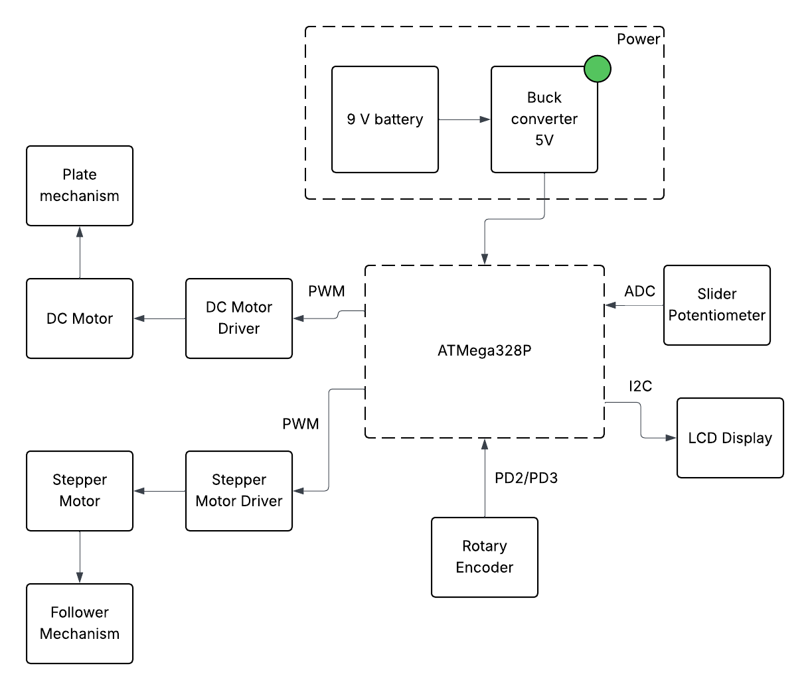
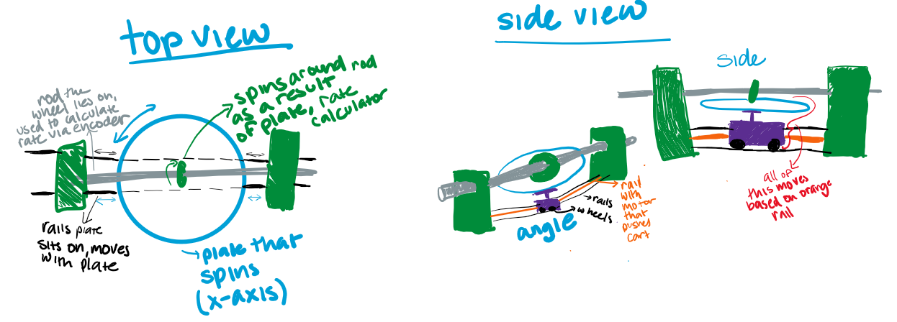
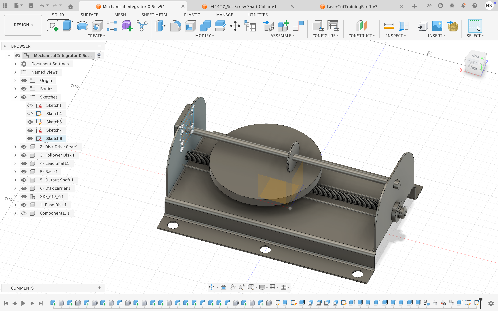
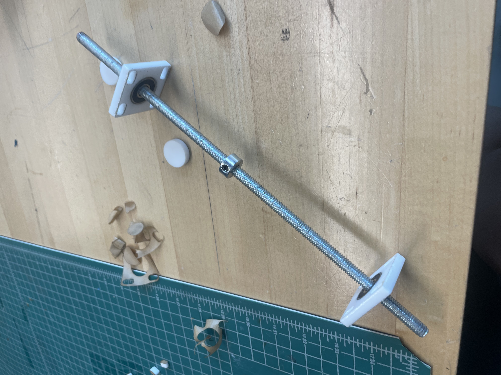
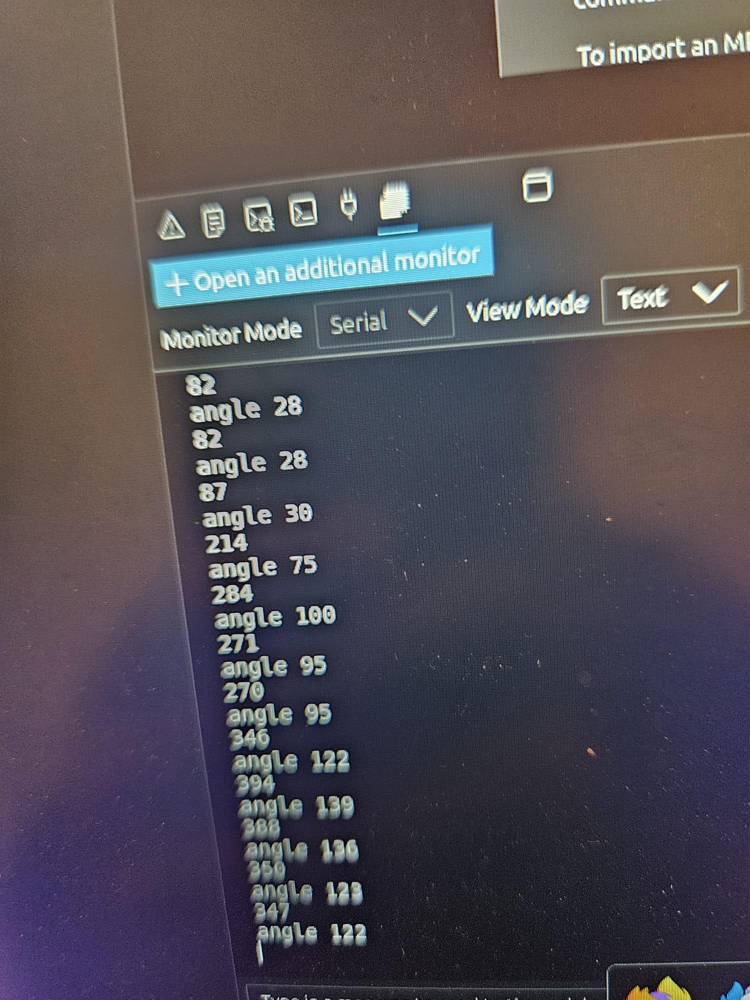
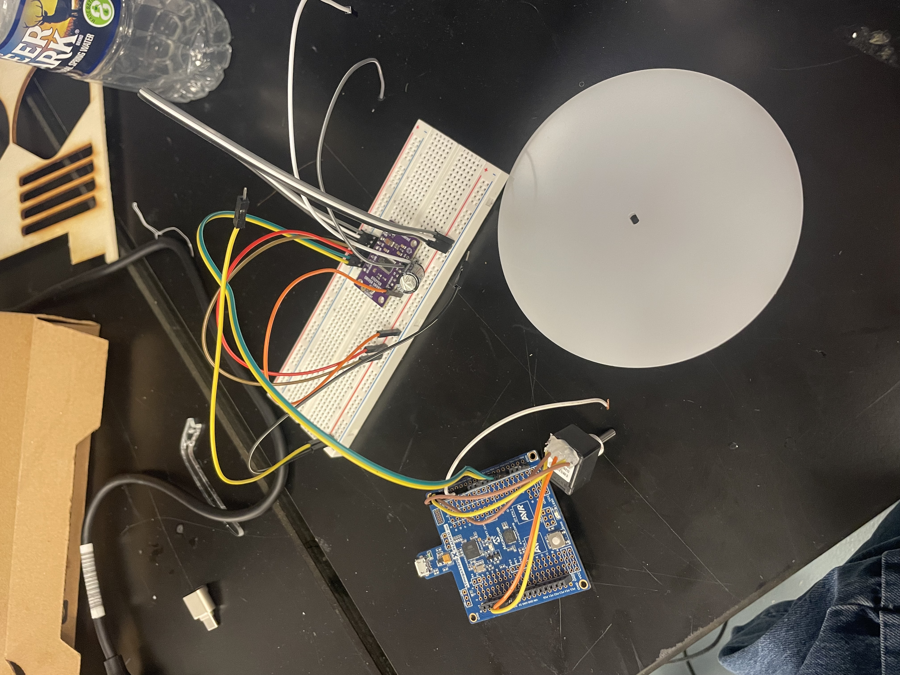
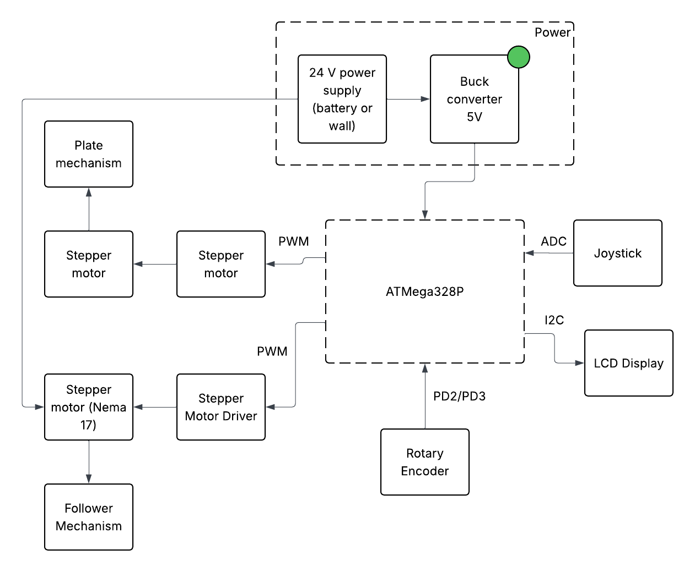

# Final Project

**Team Number: 8**

**Team Name: Integr8**

| Team Member Name | Email Address       |
|------------------|---------------------|
| Anjali Kalanidhi         | anjk@seas.upenn.edu           |
| Nevan Sujit         | tsnevan@seas.upenn.edu          |
| Sebastian William Thomann Studholme         | sthomann@seas.upenn.edu           |

**GitHub Repository URL: https://github.com/upenn-embedded/final-project-s26-t8**

**GitHub Pages Website URL:** [for final submission]*

## Final Project Proposal

### 1. Abstract
A mechanical integrator is a device that physically computes the integral of a function by converting a changing input into accumulated motion over time. Historically, mechanisms like these were used in early analog computers to solve math problems before modern digital computers were available. In this project, we are building a microcontroller-assisted mechanical integrator that demonstrates this concept in an interactive way. A slider potentiometer allows the user to control a time-varying input value, which is read by an ATmega328P microcontroller. The system drives a motor that changes speed as an analog to the function value over time and the mechanical integrator uses the motor encodings to calculate the accumulated distance travelled over time, which is an analog to an integral. The microcontroller will output the behavior of the input and the resulting integral on a small LED display and on the serial plotter. 

### 2. Motivation
We are building our mechanical integrator to create a more computation-efficient way to solve integrals, particularly because the ATMega328P is not well-suited for computing complex mathematical problems. This project is interesting because we are building a mechanical integrator, a device that was historically used to calculate complex integrals, but updating it with the modern firmware capabilities of the ATMega to show that analog based technologies still have their merits.

### 3. System Block Diagram

### 4. Design Sketches

### 5. Software Requirements Specification (SRS)

**5.1 Definitions, Abbreviations**

Here, you will define any special terms, acronyms, or abbreviations you plan to use for hardware

**5.2 Functionality**

| ID     | Description                                                                                                                                                                                                              |
| ------ | ------------------------------------------------------------------------------------------------------------------------------------------------------------------------------------------------------------------------ |
| PWM Control | The system will generate PWM signals from the microcontroller to control motor speeds smoothly and efficiently. |
| Analog Input Processing | The system will read and process analog signals from the potentiometer using the onboard ADC to determine input magnitude. |
| Encoder Processing | The system will decode signals from the rotary encoder to track position and direction. |
| Integration Computation | The system will keep track of rotary encoder input and sum values to calculate integral |
| Stepper Control Logic | The system will generate step and direction signals to control the stepper motor position based on the input function |
| DC Motor Control Logic | The system will adjust DC motor speed and direction using PWM signals to maintain consistent disk rotation. |
| Timing Control | The system will use hardware timers to maintain a fixed sampling rate for integration and motor updates. |
| Display Software | The system will update the LCD via I2C to display input values, output values, and system status in real time. |

### 6. Hardware Requirements Specification (HRS)

**6.1 Definitions, Abbreviations**

Here, you will define any special terms, acronyms, or abbreviations you plan to use for hardware
Plate: The bottom, flat, circular disk that is rotated by a motor to represent the x-axis.
Follower: the small wheel attached to a rod that spins as a result of the plate rotation

**6.2 Functionality**

| ID     | Description                                                                                                                        |
| ------ | ---------------------------------------------------------------------------------------------------------------------------------- |
| Power Supply Hardware | The system should include a 9 V battery and a buck converter to provide a stable 5 V supply to all electronic components. |
| Microcontroller Unit | The system will use an ATmega328P microcontroller to coordinate sensing, computation, and motor control. |
| User Input Hardware | The system should include a slider potentiometer that allows the user to manually define the input to the integrator. |
| Encoder Input Hardware | The system will include a rotary encoder connected to track output integral values. |
| Disk Rotation | There will be a DC motor-driven rotating plate mechanism that rotates at constant speed to represent time |
| DC Motor Driver | The system will include a motor driver to control the speed of the DC motor using PWM signals. |
| Stepper motor function input | There will be a stepper motor-driven mechanism that adjusts the location of the chassis based on the input function |
| Stepper Motor Driver | The system will include a stepper motor driver to provide precise position control via step and direction signals from the microcontroller. |
| Output Shaft Sensing | The system will include a rotary encoder mechanically coupled to the output shaft so that shaft rotation can be measured electronically. |
| Display Hardware | The system will have an LCD display connected through I2C to present system information to the user during operation. |

### 7. Bill of Materials (BOM)
A 10k slider potentiometer will serve as the primary input as it will be used as the analog for function value over time. The potentiometer will be connected to an ADC pin on the microcontroller so that the system can read the input value.

The mechanical integrator requires two motors. A DC gear motor will rotate the time disk, providing the constant motion needed for the integration process. This motor will be controlled using a motor driver, which allows the microcontroller to regulate motor speed using PWM signals. A stepper motor will be used to control the position of the follower mechanism. A stepper motor is needed here as we need precise position control and it will be driven using an EasyDriver stepper motor driver.

To measure the output of the integrator, a rotary encoder will be attached to the output shaft. The encoder will generate pulses that the microcontroller can count using interrupt pins to determine how much the shaft has rotated.

Finally, an LCD display will be used to display the integral value. The display will communicate with the microcontroller using the I2C interface and will show information such as the input value and the integrated output.

[BOM](https://docs.google.com/spreadsheets/d/1b2L2CsoX9tYtY7pSSJdgno0QYMjl8iTiAHsGNdwpyRs/edit?usp=sharing)

### 8. Final Demo Goals
On demo day, the device will be demonstrated on tabletop. A user will control the input function using the slider potentiometer, which changes the motor speed over time. As the slider is moved, the mechanical system will compute the integral through its physical motion, while the microcontroller reads and visualizes the output integral on an LED display.

During the demonstration, several simple input patterns representing basic functions will be shown, such as holding the slider at a constant value (y=c), changing it linearly over time (y=mx), and sinusoidal functions. These examples will illustrate how the output accumulates and how the integral changes based on the input. The main constraints for the demo are ensuring that the mechanical components are properly aligned and calibrated.

### 9. Sprint Planning

| Milestone  | Functionality Achieved | Distribution of Work |
| ---------- | ---------------------- | -------------------- |
| Sprint #1  |   Build the entire project on CAD. Since this project requires a fair amount of laser cutting + 3D printing, we want to make sure that we design all those parts before we design anything physically. Not only should the entire design, including the manufactured parts and electrical components be in our CAD design, but we also want to create simulations in our design for how the mechanisms should move.  | Anjali CAD's the plate & things it is connected to, Nevan CAD's the follower and things it is connected to, Sebastian CAD's all integration |
| Sprint #2  | Following this our second milestone will be to both print and assemble the manufactured parts with the electrical components, and then program the MCU to take in the potentiometer input and output the correct PWM signals and take the motor’s encodings to calculate the integral. With these two milestones, we will have essentially finished building our project. | Anjali handles printing of parts and mechanical side of things, Sebastian works on software, Nevan works on electronics. Everyone is working together to integrate, so tasks are not as clear cut |
| MVP Demo   | Potentiometer input leads to function displayed through serial monitor, integral output, as well as LCD showing the integral numerical value. | Anjali works further on mechanical/software integration, Sebastian and Nevan finish coding. Most of this week will be spent tuning device and making sure it works well. |
| Final Demo | if time permits we want to build a way for the user to draw rather than use a potentiometer to create their function. The user would draw their desired function that they want to integrate on a display and then this drawing gets converted to a list of numbers that the MCU can then read to control the PWM signal to input into the motor. The output could then also be displayed in the serial as the distance travelled by the motor over time. | Sebastian CAD's mechanical components, Anjali and Nevan work on software/electrical updates to make new features work. |

**This is the end of the Project Proposal section. The remaining sections will be filled out based on the milestone schedule.**

## Sprint Review #1

### Last week's progress
We have CAD'd most of the model for the project and ordered all the components we need. We finalized which components we wanted to go with, including picking which motors to use and deciding which components in Detkin we can use and which components we want to order. We have finalized the CAD design for the wheel and for the connectors between the frame and the rods. We have begun laser cutting and are planning on finishing assembly physically integrate our electronic components into the design next week. We still need to figure out how to add wheels to the chassis that the plate spins on and how to connect the rotary encoder to the follower wheel and shaftf, so those will be mechanical challenges we need to figure out next week.

### Current state of project
We have a pretty solid foundation for this project. We understand how it works mechanically, which parts should be connected to one another, and how we want to integrate electronics. We have all parts purchsed, and at this point we just need to focus on finishing the mechanical parts and assembly as soon as possible so we can focus on hardware.
### Next week's plan
Finishing printing and assembly, create a plan for how we are physically going to wire up our components, and create system diagrams for our code so we can integrate everything completely the week after.
| Assignee | Task | Estimated time | Finished when... |
| ---------| -----|--------------- | ---------------- |
| Nevan  | CAD and print the chassis | Two hours | The chassis is printed |
| Sebastian  | Connector between rotary encoder and follower shaft wheel | Two hours | Connector is printed and glued to rotary encoder and shaft |
| Anjali | Connect follower wheel to shaft to bearings to rotary encoder | 1 hour | Entire top piece is connected |
| Nevan | CAD and print base | Two hours | Base is printed |
| Anjali | CAD and print wheels | Two hours | Wheels are printed and connected to chassis as well as track |
| Sebastian | Final assembly | Two hours | Connect all pieces together, motors are placed in correct location |
## Sprint Review #2

### Last week's progress
We completely finished CADing and most of our parts are printed. We had to alter tolerances because we made some of them too tight, so we are currently just waiting on those last parts to print. Most of our electronics have come in as well so we have begun to write code as well as assemble. We are splitting each of the components into separate code segments and then planning on integrating all the code together. The code for the follower wheel encoder, which actually calculates the integral, is complete. 

### Current state of project
We have code for the rotary encoder that tells you the correct integral value, and most of the components assembled together, we just need to add them to the frame.
### Next week's plan
Finishing coding is top priority, then working on assembly. There are lag times in getting our mechanical parts finished, but since we have the motors and drivers we need, we can work on writing code in the meantime to make integration go smoother. Because the mechanical aspect of this project is taking longer than expected, we are focusing on getting the integral to work with a manual function input, and then will add user input the following week.
| Assignee | Task | Estimated time | Finished when... |
| ---------| -----|--------------- | ---------------- |
| Nevan  | print the frame | one hour | The frame is printed/ made sure all componenets are correct sizes/fit |
| Sebastian  | assemble the frame | two hours | mechanical frame is fully complete with all separate components |
| Anjali | integrate electronics  | 2 hour | all electronics are in the frame |
| Nevan | code the big stepper motor/y axis | five hours | the rod moves in tandem with the y axis of a function |
| Anjali | code the time/constant plate, integrate all code together | five hours | all code is complete |
| Sebastian | final integration | five hours | Connect all pieces together, motors are placed in correct location, fully integrated together |
| Nevan | Code LCD Screen output | two hours | LCD properly displays what integral value we want it to |
## MVP Demo
[Slide deck](https://docs.google.com/presentation/d/1c26fR2l8V-HrHxDpfWXI8LoWvZEP7CJ0bPEYAke9Whs/edit?usp=sharing)

System block diagram:

Hardware explanation:
The hardware system is organized around the ATmega328P microcontroller, which serves as the central controller coordinating power, sensing, and actuation. A 24 V power supply provides the primary energy source, which is stepped down to 5 V using a buck converter to safely power the microcontroller and low-voltage peripherals. User input is provided through a joystick connected to an ADC pin. The ATMega processes this input and turns it into PWM outputs for the motors. One stepper motor (turning the plate) establishes the time base by driving the plate mechanism, while another stepper motors (the heavy duty NEMA 17) is used to represent the y axis of the function input. This movement turns the follower wheel, which turns the rotary encoder connected to digital pins (PD2/PD3) which read the angle position. The ATMega then processes this data and sums up the overall change in angle to find the total integral. An LCD display communicates with the microcontroller over I2C, enabling real-time visualization of the integral as well as its value. The system operates in a closed-loop style at the user level: the user sets an input via the potentiometer or joystick, the microcontroller processes this input and generates appropriate control signals, the motors actuate the mechanical system, and the resulting motion is observed through the encoder feedback and displayed on the LCD.

Firmware implementation:
The firmware is structured into modular components that separately handle sensing, user interaction, and motor control while remaining tightly coordinated through the main control loop. One module manages the rotary encoder and LCD output, where interrupt-driven inputs from the encoder (on PD2/PD3) are used to track position or system output in real time, and this information is formatted and transmitted over I2C to the display for user feedback. A second module controls the NEMA 17 stepper motor responsible for the y-axis (input function), generating precise step and direction signals to map the user-defined input—set via the potentiometer or joystick—into accurate vertical motion. The third module governs the stepper motor driving the plate mechanism, which acts as the x-axis (time base) by running at a constant, calibrated speed to ensure a uniform progression of time. Together, these modules create a synchronized firmware architecture where the time axis advances steadily, the input axis responds dynamically to user control, and the system state is continuously measured and displayed, effectively implementing the mechanical integration behavior.

Software Requirements Specifications:
The software is designed to integrate sensing, computation, and actuation into a single cohesive system. Analog input processing is implemented thorugh the joystick, allowing user-defined inputs to be continuously sampled. Rotary encoder processing is tightly coupled with the integration computation, enabling real-time calculation of the system’s output within the same execution flow. While the integration logic is functional and produces correct mathematical behavior, further tuning of variables is required to improve accuracy and stability. During development, stack overflow issues were encountered, indicating memory constraints that required optimization of function usage and data handling. Stepper motor control for the input axis and time axis are both operational, though additional tuning is needed—particularly for incorporating encoder feedback to correct accumulated positional errors over time.

From a timing perspective, a structured scheduling approach through RTOS has been implemented to reliably sequence encoder reading, integration computation, and LCD updates, ensuring consistent real-time performance. However, this timing framework still needs to be extended to both stepper motors. The display system is complete, providing clear real-time feedback of system state, including input and output values. Overall, the software is functionally complete but requires further calibration and optimization, as well as full integration of all systems through RTOS.

Hardware Requirement Specifications:
The hardware implementation centers on the ATmega MCU. Power is currently supplied through multiple working sources, so distribution architecture still needs to be consolidated. User input is provided via a joystick that feeds analog signals into the MCU, where the ADC reliably converts them into digital values for processing. The rotary encoder is functioning well and provides consistent, accurate measurements, while the disk rotation mechanism for the time axis is also operating as expected. The display hardware and stepper motor driver are both stable and performing reliably within the system.

On the actuation side, stepper motor drivers are generally functional but require further tuning, particularly for the NEMA 17 motor, which is experiencing jitter and lag. These issues are mostly caused by mechanical factors such as friction, misalignment, or load inconsistencies in the mechanism. Overall, while the core hardware components are working, final performance depends on improving both driver tuning and mechanical integration to reduce lag and ensure consistent motion.

Risk mitigation:
To mitigate the risk of high voltage damaging components or overheating motors, hardware safeguards such as current limiting, proper driver configuration, and protective circuitry (e.g., fuses or thermal shutdown features) are implemented to prevent excessive power draw. Mechanical failures are addressed by reinforcing all structural components using secure fasteners like screws instead of adhesives, ensuring greater durability and stability under load. Together, these measures improve both electrical safety and mechanical reliability of the system.

Next steps:
The next steps focus on fully integrating the mechanical and control subsystems into a single cohesive system, ensuring that the firmware and hardware operate seamlessly together. Mechanically, the device will be assembled and reinforced, while the power system will be standardized to a single wall supply for simplicity and reliability. Additionally, debugging efforts will target stepper motor jittering to improve motion smoothness and overall system performance.

## Final Report

Don't forget to make the GitHub pages public website!
If you’ve never made a GitHub pages website before, you can follow this webpage (though, substitute your final project repository for the GitHub username one in the quickstart guide):  [https://docs.github.com/en/pages/quickstart](https://docs.github.com/en/pages/quickstart)

### 1. Video

### 2. Images

### 3. Results

#### 3.1 Software Requirements Specification (SRS) Results

| ID     | Description                                                                                               | Validation Outcome                                                                          |
| ------ | --------------------------------------------------------------------------------------------------------- | ------------------------------------------------------------------------------------------- |
| SRS-01 | The IMU 3-axis acceleration will be measured with 16-bit depth every 100 milliseconds +/-10 milliseconds. | Confirmed, logged output from the MCU is saved to "validation" folder in GitHub repository. |

#### 3.2 Hardware Requirements Specification (HRS) Results

| ID     | Description                                                                                                                        | Validation Outcome                                                                                                      |
| ------ | ---------------------------------------------------------------------------------------------------------------------------------- | ----------------------------------------------------------------------------------------------------------------------- |
| HRS-01 | A distance sensor shall be used for obstacle detection. The sensor shall detect obstacles at a maximum distance of at least 10 cm. | Confirmed, sensed obstacles up to 15cm. Video in "validation" folder, shows tape measure and logged output to terminal. |
|        |                                                                                                                                    |                                                                                                                         |

### 4. Conclusion

## References

